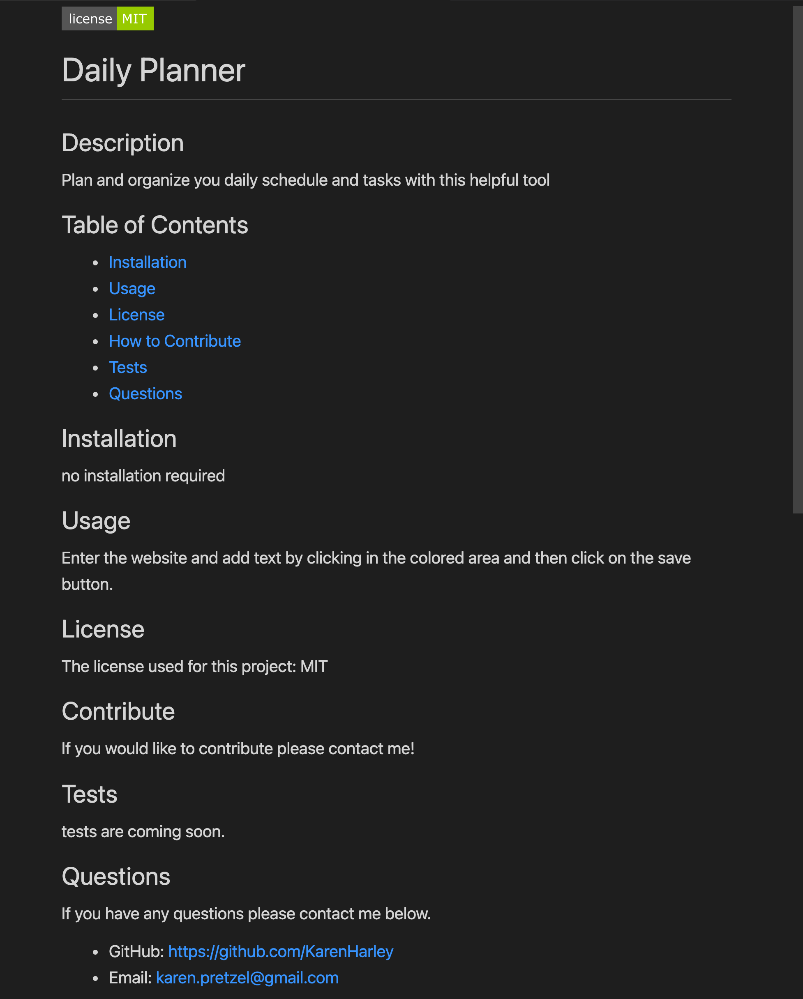

  [](https://github.com/DAVFoundation/captain-n3m0/blob/master/LICENSE)
  # Professional README Generator
  ## Description
This application generates a README file based on user input. After the user enters the text needed for all the sections that a professional README should have, a new README file is created and a license badge is added (according to the selected license).

   ## Table of Contents 

 - [How to use](#How-to-use)
  - [Installation](#installation)
  - [Usage](#usage)
  - [License](#license)
  - [How to Contribute](#contribute)
  - [Tests](#tests)
  - [Questions](#questions)

<br/>
<br/>
  
  ## Installation
  ```zsh
  npm install
  ```
  ## Usage
  Invoke the application with the command: 
  ```zsh
 node index.js
  ```
  After invoking the application you will be with prompted seveal questions, such as the one below. Answering these questions will help this application create the perfect README for your project! 


<p align="center">
  
</p>
  

 Then, after responding to all of the questions and selecting a license a README file like the one below will be created.

   

  ## License
  The license used for this project: MIT
  ## Contribute
  If you would like to contribute please contact me.
  ## Walkthough
  https://drive.google.com/file/d/1NP7CWH2iJLGAR12bfhTSx9tDiK1Bbv5Z/view
  ## Questions
  To reach me please contact me in the email address below.

  - GitHub: https://github.com/KarenHarley
  - Email: karenharley88@gmail.com
    
    
  
   
  
